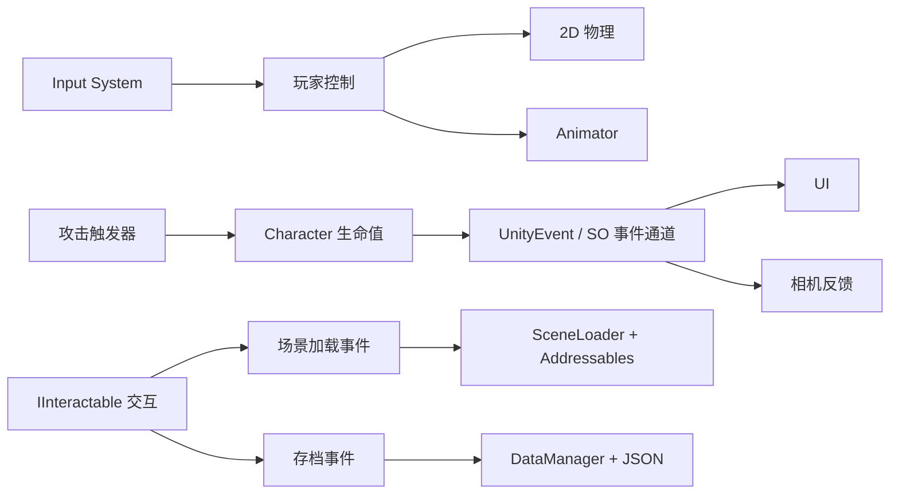
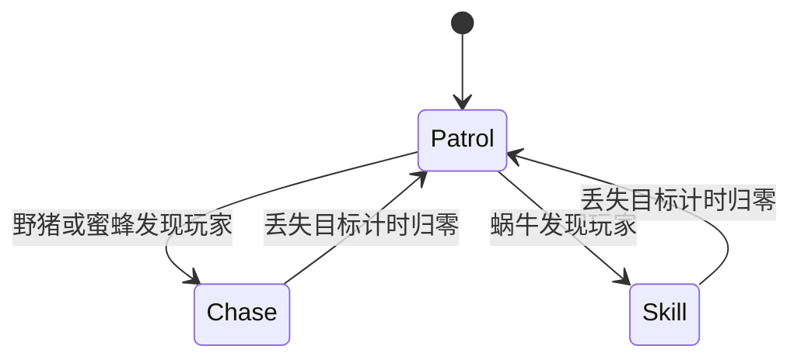

# 勇者奇谭 — Unity 2D 横版动作游戏

[返回项目首页](../README.md)

> 本文所述脚本和工程目录来自本地原始 Unity 工程。当前 GitHub 仓库尚未收录完整工程，以下源码路径用于解释实现，不代表对应文件已经上传。

本项目基于 Unity 和 C# 开发，以横版移动、跳跃、近战攻击和关卡探索为主要交互。项目包含野猪、蜜蜂、蜗牛三类敌人，以及宝箱、存档点、场景传送、生命值 UI、背景音乐和音效等系统。

本文依据项目中的脚本、场景、动画和配置整理，重点说明实际使用的算法、数据结构与工程技术。游戏名称为“勇者奇谭”。

> 验证范围：已静态核对代码及资源配置；本次文档整理未启动 Unity、运行游戏或执行平台构建。以下功能描述不代表已通过完整运行测试。

## 1. 技术栈

| 技术 | 项目版本 / 形式 | 实际用途 |
| --- | --- | --- |
| Unity | 2022.3.42f1c1 | 场景、组件、资源管理与游戏运行环境 |
| C# | MonoBehaviour、接口、继承、委托 | 游戏行为、模块通信与数据处理 |
| Unity 2D Physics | Rigidbody2D、Collider2D、Physics2D | 移动、跳跃、击退、攻击判定与环境检测 |
| Input System | 1.7.0 | 键盘、手柄输入和屏幕虚拟控件 |
| URP | 14.0.11 | 项目渲染管线，包含 Renderer2D 配置 |
| Tilemap | Unity 2D 工具链 | 网格关卡、地形绘制与碰撞轮廓 |
| Animator | 动画状态机、StateMachineBehaviour | 角色动画、攻击窗口和动作状态同步 |
| Cinemachine | 2.10.5 | 虚拟相机、边界限制与受击震屏 |
| Addressables | 1.22.3 | 场景资源引用、异步加载与卸载 |
| ScriptableObject | 场景配置、事件通道 | Inspector 配置与跨模块通信 |
| Newtonsoft Json | Unity 包 3.2.2 | 字典等存档数据的 JSON 序列化 |
| Unity JsonUtility | 引擎内置 | 场景配置的 JSON 转换与重建 |
| uGUI / TextMesh Pro | 1.0.0 / 3.0.6 | 菜单、状态栏、按钮、滑条与文字 UI |
| DOTween | `Assets/Plugins/Demigiant/DOTween` | 场景切换遮罩的颜色渐变 |
| AudioSource / AudioMixer | 引擎内置 | 背景音乐、音效和主音量控制 |

版本依据 `ProjectSettings/ProjectVersion.txt` 和 `Packages/manifest.json`。清单中还包含 Timeline、Visual Scripting、Test Framework 等包，但仅有依赖不能证明业务代码已使用这些功能，因此未将它们列为已实现的核心系统。

## 2. 功能与操作

已在代码或资源中实现的内容包括：

- 玩家水平移动、落地检测、跳跃、近战攻击、受击击退和死亡处理。
- 三类敌人的巡逻、追击或防御技能行为。
- 宝箱开启、存档点激活与关卡传送。
- 初始化场景、常驻系统场景、菜单场景和关卡场景的组织。
- 角色位置、生命值和当前场景的存档与读取。
- 血条、延迟扣血显示、暂停面板、失败面板和音量调节。
- 键盘、手柄绑定及移动端虚拟控件配置。

| 操作 | 键盘 | 手柄 |
| --- | --- | --- |
| 水平移动 | A / D 或左右方向键 | 左摇杆 |
| 跳跃 | Space | 南侧按键，通常为 A / × |
| 攻击 | J | 西侧按键，通常为 X / □ |
| 交互 | E | 东侧按键，通常为 B / ○ |
| 调试读档 | L | 未配置对应绑定 |
| 暂停与设置 | 点击设置按钮 | 通过 UI 操作，未配置专用 Gameplay 暂停动作 |

输入文件还绑定了上下方向，但 `PlayerController.Move()` 只使用输入向量的 X 分量。L 键由 `DataManager.Update()` 直接读取，不属于 Input Actions 配置。

## 3. 项目结构与系统架构

```text
Assets/
├── Scripts 代码/
│   ├── Player/                 玩家控制、动画、交互提示
│   ├── Enemy/                  敌人基类与状态机
│   ├── General/                生命值、攻击、物理检测、宝箱
│   ├── Transition 场景转换/    初始化、场景加载、传送
│   ├── Save Load/              存档接口、数据管理、存档点
│   ├── ScriptableObject/       事件通道与场景配置类型
│   ├── UI/                     血条、菜单、暂停与淡入淡出
│   ├── Audio/                  音频请求与播放管理
│   └── Utilities 工具类型/     相机、枚举、交互接口
├── Data SO/                    事件通道和场景配置实例
├── Scenes/                     Persistent、Menu、MainScene、Forest
├── Settings/                   输入、渲染、混音器、初始化场景
├── AddressableAssetsData/      Addressables 分组与构建配置
├── Animations 动画/            玩家、敌人与 UI 动画资源
├── Prefabs/                    可复用游戏对象
└── Plugins/                    DOTween 等插件
Packages/                       包依赖
ProjectSettings/                Unity 项目设置
```

项目主要通过“组件组合 + 状态模式 + 事件通道”组织业务：

- **组件组合**：控制、动画、生命值和物理检测分属不同组件，同一对象组合这些组件形成完整行为。
- **继承与多态**：`Enemy` 提供通用能力，`Boar`、`Bee`、`Snail` 配置各自状态并按需重写检测或移动。
- **接口抽象**：`IInteractable` 统一交互入口；`ISaveable` 统一存档数据采集和恢复入口。
- **事件通信**：ScriptableObject 事件通道让 UI、音频、相机和场景管理器订阅同一业务事件。
- **集中数据管理**：`DataManager` 使用静态实例和注册列表管理存档参与者，并以执行顺序 `-100` 提前初始化。



## 4. 核心算法与行为逻辑

### 4.1 玩家运动、跳跃与击退

对应脚本：`PlayerController.cs`、`PlayerAnimation.cs`。

输入在 `Update()` 中读取，水平速度在 `FixedUpdate()` 中更新；当前代码为：

```csharp
rb.velocity = new Vector2(
    speed * Time.deltaTime * inputDirection.x,
    rb.velocity.y
);
```

该实现保留竖直速度，让重力和跳跃继续由物理系统处理；水平输入的正负用于修改 `localScale.x`，控制角色朝向。受击或攻击状态下跳过常规水平速度赋值。

需要正确理解这里的时间关系：`Rigidbody2D.velocity` 已表示单位时间的速度，再乘 `deltaTime` 会让速度参数与物理步长产生耦合。上面展示的是项目现状；如果后续改为直接使用 `speed * inputDirection.x`，需要同步重新标定移动参数。

跳跃仅在 `isGround` 为真时施加向上的冲量。用物理关系表示，冲量带来的速度变化为 `Δv = J / m`，由 Unity 物理引擎计算。当前没有实现二段跳、跳跃输入缓冲或离地宽限时间。

受击时，先清零速度，再计算水平击退方向：

```text
direction = Normalize((受击者.x - 攻击者.x, 0))
impulse   = direction × hurtForce
```

玩家依赖受伤动画退出时解除 `isHurt`；敌人使用协程等待 0.45 秒解除受伤标记。

### 4.2 环境检测与碰撞查询

对应脚本：`PhysicsCheck.cs`、`Enemy.cs`、`Bee.cs`。

`PhysicsCheck` 在角色下方、左侧和右侧执行三个 `Physics2D.OverlapCircle` 查询，分别得到落地、左侧接触和右侧接触状态。检测通过偏移、半径和 `LayerMask` 配置；底部偏移的 X 分量随角色朝向翻转。

地面敌人还用 `Physics2D.BoxCast` 沿朝向扫描指定距离，判断攻击层中是否存在目标。蜜蜂重写检测方法，用 `OverlapCircle` 查询周围目标，并保存目标的 Transform。

这些调用使用 Unity 物理引擎提供的空间查询。项目自写的是检测位置、筛选层和行为响应，没有自行实现碰撞引擎。目标检测也没有额外的遮挡验证，因此不能等同于完整视线系统。

玩家在地面和空中切换两种 `PhysicsMaterial2D`，用于调整接触摩擦。关卡场景还使用 `TilemapCollider2D` 和 `CompositeCollider2D` 组织地形碰撞。

### 4.3 敌人有限状态机（FSM）

对应脚本：`BaseState.cs`、`Enemy.cs` 和各敌人状态脚本。

每个状态通过四个方法组织行为：

| 方法 | 职责 |
| --- | --- |
| `OnEnter(Enemy)` | 初始化当前状态、速度、动画和计时器 |
| `LogicUpdate()` | 检查目标、更新方向、判断状态转换 |
| `PhysicsUpdate()` | 执行状态相关的物理更新 |
| `OnExit()` | 清理动画标记或状态效果 |

`Enemy.SwitchState()` 按枚举取得状态对象，依次执行“退出旧状态 → 替换当前状态 → 进入新状态”。状态对象在敌人 `Awake()` 中创建并复用。

| 敌人 | 状态 | 主要行为 |
| --- | --- | --- |
| 野猪 Boar | Patrol / Chase | 常速巡逻；发现玩家后加速；遇墙或前方无地面时转向；丢失目标超时后恢复巡逻 |
| 蜜蜂 Bee | Patrol / Chase | 在出生点附近选取随机目标；发现玩家后朝目标飞行；进入攻击范围后停止追赶并按间隔触发攻击动画 |
| 蜗牛 Snail | Patrol / Skill | 巡逻；发现玩家后触发缩壳技能与无敌状态；丢失目标超时后退出技能 |



这是三种敌人规则的合并示意；单个敌人只实例化自己需要的状态。受伤和死亡主要由布尔标记及 Animator 处理，没有单独作为 `NPCState` 状态实现。

野猪的 Chase 主要是沿朝向加速移动，配合障碍转向。它没有计算导航路线；蜜蜂则直接朝目标方向飞行。因此项目使用的是规则驱动 FSM，没有实现 A*、导航网格寻路、行为树或机器学习 AI。

### 4.4 随机巡逻与归一化追踪

对应脚本：`Bee.cs`、`BeePatrolState.cs`、`BeeChaseState.cs`。

蜜蜂的新巡逻点由两个独立随机数产生：

```text
targetX = spawnX + Random(-r, r)
targetY = spawnY + Random(-r, r)
```

因此实际采样范围是以出生点为中心、边长为 `2r` 的正方形。虽然 Gizmos 绘制了半径 `r` 的圆形辅助线，代码并不是在圆内采样。

移动方向使用向量归一化：

```text
direction = Normalize(target - position)
velocity  = direction × currentSpeed × deltaTime
```

归一化使方向向量的长度不随目标距离增长，避免把距离直接当作速度。当前实现同样存在速度乘时间步长的耦合；也没有避障或最后一步的到达距离截断。

巡逻到达判断为 X、Y 误差都小于 0.1。追击目标位于玩家位置上方 1.5 个单位，攻击条件为：

```text
abs(targetX - x) <= attackRange
且 abs(targetY - y) <= attackRange
```

这里的攻击判定区域也是轴对齐方形，而不是欧氏距离圆。

### 4.5 倒计时控制与伤害限频

对应脚本：`Enemy.cs`、`BeeChaseState.cs`、`Character.cs`。

项目多个系统采用相同的倒计时形式：`counter -= Time.deltaTime`，在归零时触发行为。

| 计时器 | 用途 |
| --- | --- |
| `waitTimeCounter` | 敌人巡逻等待结束后恢复移动或转向 |
| `lostTimeCounter` | 发现玩家时重置；丢失玩家后递减，避免立刻退出追击或技能 |
| `attackRateCounter` | 蜜蜂在攻击范围内按间隔触发攻击动画 |
| `invulnerableCounter` | 非致死受击后的短暂无敌，减少连续接触带来的重复扣血 |

攻击区域使用 `OnTriggerStay2D` 持续尝试调用 `Character.TakeDamage()`。角色处于无敌状态时直接返回；否则扣血，并触发受伤或死亡事件及血量更新。

“攻击动画间隔”和“无敌时间”分别控制攻击表现与伤害接收，不能将 `Attack.attackRate` 理解为所有碰撞伤害的统一冷却。带有 `Water` 标签的触发区域另行将生命值清零。

### 4.6 动画驱动的攻击窗口

对应资源：`PlayerAnimation.cs`、`AttackFinish.cs`、`HurtAnimation.cs`、玩家攻击动画。

`PlayerAnimation` 将水平速度绝对值、竖直速度、落地、死亡和攻击标记写入 Animator。动画状态机根据这些参数切换动作。

- `AttackFinish` 在攻击状态进入与退出时维护 `isAttack`。
- `HurtAnimation` 在受伤状态退出时解除 `isHurt`。
- 玩家攻击动画通过 `m_IsActive` 曲线启用和禁用攻击区域对象，使伤害判定与挥击时间窗口关联。
- 敌人死亡动画包含 `DestroyAfterAnimation` 事件，用于在动画结束阶段销毁对象。

业务 FSM 管理“敌人要做什么”，Animator 管理“动作如何表现”；两者通过参数、行为回调和动画事件协同。

## 5. 工程系统与数据处理

### 5.1 ScriptableObject 事件通道

`VoidEventSO`、`FloatEventSO`、`CharacterEventSO`、`SceneLoadEventSO`、`FadeEventSO` 和 `PlayAudioEventSO` 分别承载无参数、数值、角色、场景、遮罩及音频事件。

通道使用 `UnityAction` 保存回调。模块通常在 `OnEnable()` 订阅、在 `OnDisable()` 退订，再由 `RaiseEvent()` 一类方法通知订阅者。这是发布订阅 / 观察者模式的应用。

例如玩家受伤后，`Character` 发出 UnityEvent，场景中配置的监听器进一步触发角色动画、击退、血条更新和相机震动。新增反馈通常可以通过监听同一个事件完成。

这些委托调用是同步发生的，并不是后台消息队列。事件资源和 Inspector 引用仍需要正确配置，才能连接完整流程。

### 5.2 常驻场景与异步场景切换

对应脚本：`InitialLoad.cs`、`SceneLoader.cs`、`TeleportPoint.cs`、`GameSceneSO.cs`。

场景职责如下：

| 场景 | 职责 |
| --- | --- |
| `Settings/Scenes/Initialization.unity` | 启动入口，通过 Addressables 加载 Persistent |
| `Scenes/Persistent.unity` | 保存玩家、相机、UI 和管理器等跨关卡对象 |
| `Scenes/Menu.unity` | 菜单内容 |
| `Scenes/MainScene.unity` | 游戏关卡 |
| `Scenes/Forest.unity` | 游戏关卡 |

常规切换流程：

1. `TeleportPoint` 或菜单发出场景加载请求，携带目标场景、落点和遮罩开关。
2. `SceneLoader` 用 `isLoading` 拦截加载过程中的重复请求。
3. 有旧场景时，根据配置转黑、等待过渡时间，并卸载旧内容场景。
4. 旧场景卸载后临时禁用玩家，再以 `LoadSceneMode.Additive` 异步加载目标场景。
5. 加载完成回调更新当前场景、设置玩家位置并重新激活玩家。
6. 恢复遮罩；目标为 Location 时广播完成事件，恢复 Gameplay 输入并更新相机边界。

首次没有内容场景时直接加载目标场景。`Persistent` 不随内容关卡一起卸载。协程用于等待过渡和异步操作；它不是项目自行创建的工作线程。

### 5.3 存档：接口、GUID、字典与 JSON

对应脚本：`ISaveable.cs`、`DataDefinition.cs`、`DataManager.cs`、`Data.cs`、`Character.cs`。

存档使用统一的数据容器：

| 数据字段 | 类型 | 含义 |
| --- | --- | --- |
| `sceneToSave` | string | 场景 ScriptableObject 的 JSON 字符串 |
| `characterPosDict` | Dictionary<string, SerializeVector3> | 以对象 ID 保存位置 |
| `floatSavedData` | Dictionary<string, float> | 以 `ID + "health"` 保存生命值 |

`DataDefinition.OnValidate()` 在 ReadWrite 类型且 ID 为空时生成 GUID；`SerializeVector3` 将 Unity 坐标拆成普通的 x、y、z 字段。字典支持按 ID 关联对象和状态，典型哈希查找的平均时间复杂度为 O(1)。复制对象时仍需检查 ID 是否重复。

保存时，`DataManager` 遍历已注册的 `ISaveable` 对象收集数据，再用 Newtonsoft Json 序列化并写入：

```text
Application.persistentDataPath/SAVE DATA/data.sav
```

该文件扩展名为 `.sav`，实际内容为 JSON。场景数据在容器内部又保存为一段由 `JsonUtility` 生成的 JSON 字符串。

启动时从磁盘读取已有存档到内存；执行 `Load()` 时遍历当前注册对象，用内存数据恢复状态。`SceneLoader.LoadData()` 根据存档场景和玩家位置发起场景切换。

当前 `Chest` 与 `SavePoint` 没有实现 `ISaveable`，所以宝箱开启和存档点点亮状态未纳入该持久化流程。代码也未提供完整的跨场景敌人状态恢复机制，不能将此存档描述为整个游戏世界的快照。

### 5.4 统一交互接口

`IInteractable` 只有一个方法：`TriggerAction()`。宝箱、传送点和存档点各自实现该方法，玩家附近的 `Sign` 组件获取目标接口后统一调用。

这种多态分发避免了在玩家脚本中逐个判断“这是宝箱还是传送门”。宝箱开启后替换 Sprite；存档点点亮后广播保存事件；两者通过状态标记和移除交互标签限制重复触发。

### 5.5 UI、相机与音频

**生命值 UI** 使用 `currentHealth / maxHealth` 得到比例，再写入 `Image.fillAmount`。延迟血条在高于即时血条时按 `deltaTime` 逐步减小，属于线性追赶效果，当前没有目标值钳制。`powerImage` 虽有字段，但未实现对应的能量系统逻辑。

**暂停** 通过切换面板和 `Time.timeScale = 0 / 1` 实现；依赖缩放时间的物理与计时随之暂停。音量滑条和按钮通过 uGUI 事件连接业务。

**镜头反馈** 使用 Cinemachine 虚拟相机。关卡加载后查找带 `Bounds` 标签的对象，将其 Collider2D 设置为 Confiner2D 的边界，并清除边界缓存；受击事件通过 `CinemachineImpulseSource.GenerateImpulse()` 产生震动。

**画面过渡** 由 `FadeEventSO` 发布目标颜色及持续时间，`FadeCanvas` 使用 DOTween 的 `DOBlendableColor` 驱动遮罩变化。

**音频** 由 `AudioDefination` 发出播放请求，`AudioManager` 分别控制 BGM 和 FX 的 AudioSource。音量映射为：

```text
MasterVolume = sliderValue × 100 - 80
sliderValue  = (MasterVolume + 80) / 100
```

滑条从 0 到 1 对应混音器参数从 -80 到 +20 dB；这是对分贝值的线性映射。FX 当前采用替换 clip 后 `Play()` 的方式，同一音源上的新音效可能打断旧音效，未实现多音效并发播放池。

## 6. 运行与构建入口

1. 使用与项目匹配的 Unity `2022.3.42f1c1` 打开项目根目录，等待资源导入和依赖解析完成。
2. 从 `Assets/Settings/Scenes/Initialization.unity` 启动 Play Mode，使常驻管理器按设计初始化。
3. 检查 Addressables 的 `Scenes` 分组，其中应包含 `Persistent`、`Menu`、`MainScene`、`Forest`。
4. 检查 `Data SO` 事件资源、玩家组件、相机 Bounds、地形层和 Inspector 引用，确保没有缺失。
5. 发布前为目标平台构建 Addressables 内容，并确认 Player 构建包含所需本地资源。

当前 Build Settings 只启用了 Initialization 场景，其余场景通过 Addressables 加载。直接从单个关卡运行可能缺少常驻系统，不能替代完整入口验证。

项目包含 Android 配置和映射到 Gamepad 控件路径的屏幕按钮 / 摇杆，桌面构建代码会隐藏移动端控件。但移动端输入空值处理与真机运行仍需验证，不能仅凭这些配置认定 Android 版本已发布或可稳定运行。

## 7. 当前实现的限制与后续改进

以下为静态检查中可见的具体问题或边界，本次文档整理没有修改游戏逻辑：

| 位置 | 当前情况 | 后续处理方向 |
| --- | --- | --- |
| `PlayerController`、`Enemy`、蜜蜂移动状态 | 设置 velocity 时额外乘 `deltaTime` | 统一速度单位并重新校准参数 |
| `SceneLoader.OnDisable()` | 调用了 `RegisterSaveData()` | 改为对应退订方法，避免保留无效存档参与者 |
| `Sign` | `OnDisable()` 未退订输入回调；没有 `OnTriggerExit2D()` 清理交互目标 | 完善订阅生命周期和离开交互范围后的处理 |
| `DataManager.Update()` | 直接访问 `Keyboard.current.lKey` | 无键盘设备时先判空，或接入统一 Input Action |
| `DataDefinition` 与存档注册 | ReadWrite 用于 ID 生成，但注册未按持久化类型过滤，复制对象也可能沿用 ID | 检查空 ID、重复 ID 和持久化类型 |
| `DataManager` | 缺少损坏存档、读写异常和数据版本处理 | 增加错误处理、默认值及版本迁移；必要时采用临时文件替换 |
| `SceneLoader` | 加载完成回调未检查异步操作是否成功 | 失败时恢复状态、解除加载锁并给出提示 |
| `Enemy.onDie()` | 设置动画与层，但未在方法内设置 `isDead` | 核对死亡期间的移动与伤害响应，并统一状态处理 |
| `PhysicsCheck.cs` | 运行时脚本包含未使用的 `using UnityEditor` | 清理编辑器引用并验证 Player 构建 |
| `PlayerStatBar` | 延迟血条只递减，未完善回血同步与下限钳制 | 对齐目标血量，处理回血和浮点越界 |

资源包和插件的使用权应以各自随附许可为准；本 README 不替第三方素材声明开源许可。

## 8. 源码阅读索引

下表脚本路径相对于 `Assets/Scripts 代码/`；输入配置文件另行给出相对于项目根目录的路径。

| 想了解的内容 | 主要文件 |
| --- | --- |
| 玩家控制与输入响应 | `Player/PlayerController.cs`；输入配置为 `Assets/Settings/Input System/PlayerInputControl.inputactions` |
| 地面、墙体检测 | `General/PhysicsCheck.cs` |
| 攻击与生命值 | `General/Attack.cs`、`General/Character.cs` |
| FSM 结构 | `Enemy/BaseState.cs`、`Enemy/Enemy.cs` |
| 蜜蜂随机巡逻与追踪 | `Enemy/Bee.cs`、`Enemy/BeePatrolState.cs`、`Enemy/BeeChaseState.cs` |
| 野猪与蜗牛行为 | `Enemy/BoarPatrolState.cs`、`Enemy/BoarChaseState.cs`、`Enemy/SnailSkillState.cs` |
| 交互接口 | `Utilities 工具类型/IInteractable.cs`、`Player/Sign.cs` |
| 事件通道 | `ScriptableObject/` |
| 场景生命周期 | `Transition 场景转换/InitialLoad.cs`、`Transition 场景转换/SceneLoader.cs` |
| 存档结构与流程 | `Save Load/Data.cs`、`Save Load/ISaveable.cs`、`Save Load/DataManager.cs` |
| 动画状态同步 | `Player/PlayerAnimation.cs`、`Player/AttackFinish.cs`、`Player/HurtAnimation.cs` |
| UI 与音频 | `UI/UIManager.cs`、`UI/PlayerStatBar.cs`、`Audio/AudioManager.cs` |
| 相机与过渡效果 | `Utilities 工具类型/CameraControl.cs`、`UI/FadeCanvas.cs` |

配置依据：`Packages/manifest.json`、`ProjectSettings/ProjectVersion.txt`、`ProjectSettings/EditorBuildSettings.asset`、`ProjectSettings/GraphicsSettings.asset`，以及 `Assets/AddressableAssetsData/`、场景和动画资源。
